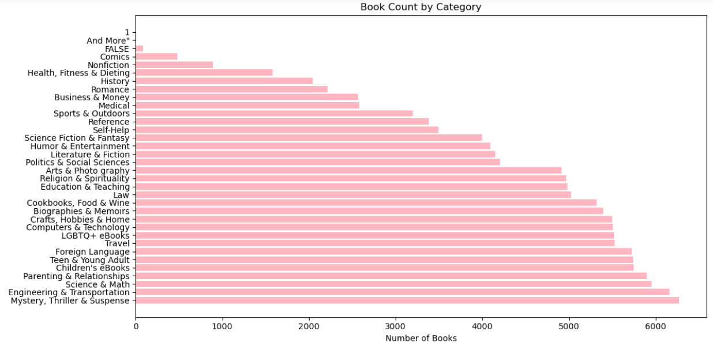
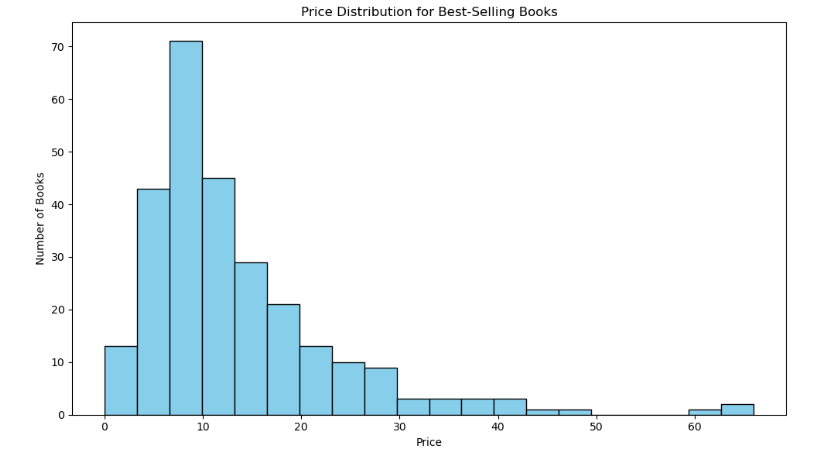

# Kindle Book Data Analysis with PySpark

##  Project Overview  
This project provides a comprehensive analysis of the Kindle e-book dataset using Apache Spark's PySpark framework.  
The goal is to extract meaningful insights about book categories, pricing, authorship, and bestseller trends in the Kindle marketplace.  
By leveraging the power of distributed computing with PySpark, this analysis handles large-scale data efficiently and uncovers key patterns influencing reader preferences and market dynamics.

---

##  Key Features & Insights

1. **Comprehensive Category Breakdown**  
   Identify the most popular and highest-grossing book per category and top categories to understand reader preferences and market trends.

2. **Price vs. Sales Dynamics**  
   Explore how pricing strategies should be made by analyzing the top expensive books and their sales for maximizing sales.

3. **Author Impact Analysis**  
   Spotlight top-performing authors by examining their books.

4. **Bestseller Identification**  
   Pinpoint bestselling books and using it to know about trends .

5. **Author Productivity Metrics**  
   Assess the distribution of books per author and their price-point.
---
##  Visualizations

Below are some key visualizations generated from the Kindle book dataset:

### 1. Book Count per Category  

---

### 2. Price Distribution per Category  

---

### 3. Price vs Average Ratings for Top Categories  

---

### 4. Price Distribution for Best-Selling books  

##  Technologies Used

- **Apache Spark (PySpark):** Distributed data processing framework for big data analytics.  
- **Python:** Programming language for data manipulation and analysis.  
- **Jupyter Notebook:** Interactive environment to write and run analysis code.  
- **Pandas & Matplotlib / Seaborn:** For additional data visualization.

---
## Dataset Source

The Kindle e-book dataset used in this project is sourced from [Kaggle](https://www.kaggle.com).  
##  How to Use

- Explore the Jupyter notebook for detailed analysis steps and visualizations.  
- Modify or extend the analysis by adding your own PySpark queries and visualizations.  
- Use this project as a foundation to analyze other large-scale book or retail datasets.

---

